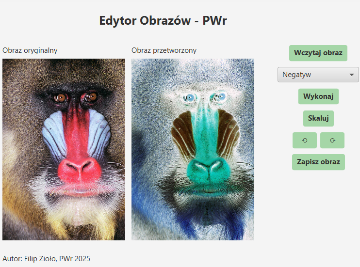

# 🖼️ Image Editor - JavaFX

This is a desktop image editor application built with **JavaFX** as part of a university project at Wrocław University of Science and Technology (PWr).

## ✨ Features

- Load `.jpg` images from your computer
- View original and processed versions side by side
- Apply image transformations:
  - Negative
  - Thresholding
  - Edge Detection
  - Scaling (with dimension input)
  - Rotation (90° left or right)
- Save the processed image
- Smooth UI interactions thanks to multithreading
- Logging of all user actions and errors

## ✅ Technologies

- Java 19
- JavaFX 19
- Maven
- SwingFXUtils (for image saving)
- Built-in Java Logging API

## 💾 Screenshots

